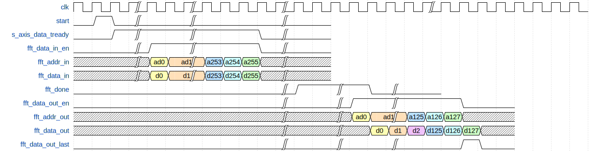

# fft 接口逻辑

## 1 接口信号

| 信号名或变量名     | 方向  | 位宽或大小       | 描述                                                      |
| ------------------ | ----- | ---------------- | --------------------------------------------------------- |
|                    |       |                  |                                                           |
| RAM_DATA_WIDTH     | param | 16               | fft内部大部分数据位宽为16，内部ram宽度为16x2              |
| RAM_ADDR_WIDTH     | param | 8                | fft内外部ram地址位宽                                      |
| INOUT_DATA_WIDTH   | param | 12               | 输入输出数据位宽                                          |
| MUTI               | param | 1                | 控制内部位宽参数，无需调整                                |
|                    |       |                  |                                                           |
| clk                | i     | 1                | fft模块工作时钟                                           |
| rst_n              | i     | 1                | 复位                                                      |
| fft_data_in        | i     | INOUT_DATA_WIDTH | 待fft数据，外部输入, 不需要补0, ad_clk                    |
| fft_addr_in        | i     | RAM_ADDR_WIDTH   | 外部输入,连接内部异步ram, ad_clk                          |
| fft_data_in_en     | i     | 1                | 外部输入,连接内部异步ram，输入信号有效, ad_clk            |
| ad_clk             | i     | 1                | 异步ram fft数据输入w端clk                                 |
| s_axis_data_tready | o     | 1                | ram中无数据时拉高，收到256个有效输入数据后拉低，ad_clk    |
| fft_data_out_en    | i     | 1                | fft数据读出的请求信号，hdmi_clk                           |
| fft_data_out_last  | o     | 1                | fft向外部输出最后一位，hdmi_clk                           |
| fft_data_out       | o     | 1                | fft向外部输出数据，在有效信号后一个时钟周期输出，hdmi_clk |
| fft_addr_out       | i     | RAM_ADDR_WIDTH   | fft数据读出时的输入地址，hdmi_clk                         |
| hdmi_clk           | i     | INOUT_DATA_WIDTH | 异步ram fft数据输出r端clk                                 |
| fft_done           | o     | 1                | fft算法完成信号，开始读取fft后数据时拉低，hdmi_clk        |
| ram_waddr_max1     | o     | RAM_ADDR_WIDTH   | 主频                                                      |
| ram_waddr_max2     | o     | RAM_ADDR_WIDTH   | 副频                                                      |

## 2 接口时序

             
图1-2：接口时序
 

