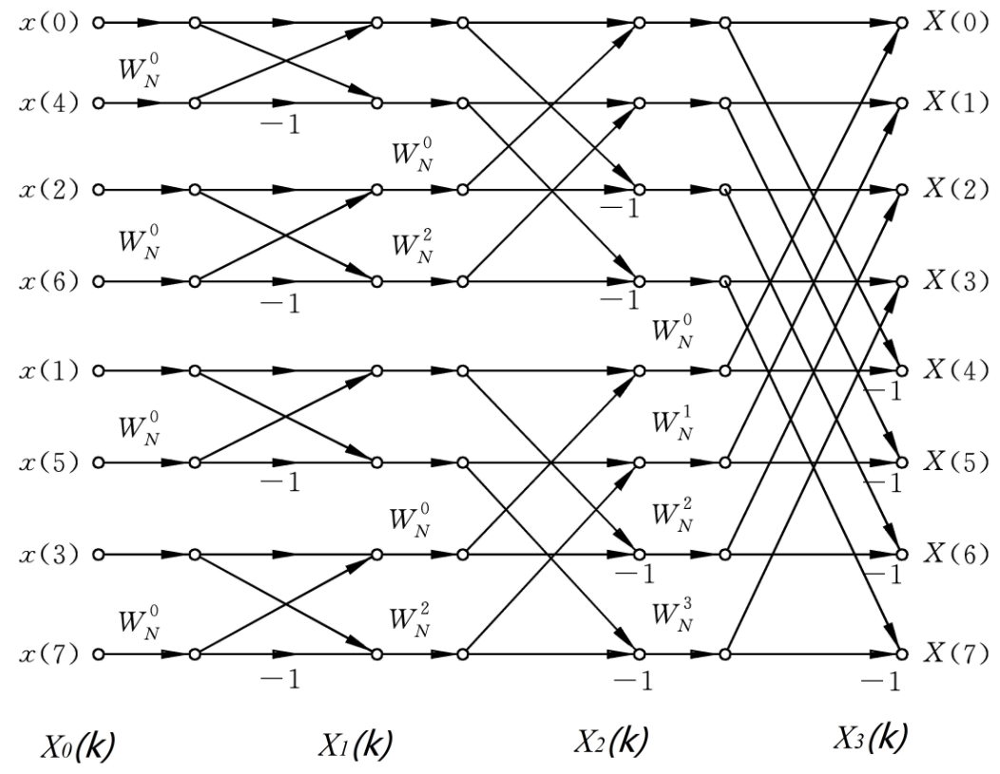
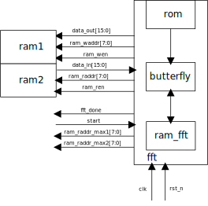
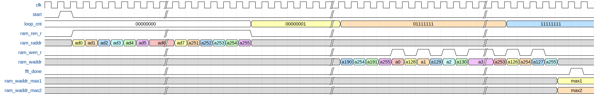

# fft 设计文档

作者：周成蹊

日期：2024.9.15

文档版本：ver 0.1

| 日期      | 修订版本 | 描述         | 作者   |
| --------- | -------- | ------------ | ------ |
| 2024.3.24 | ver 0.1  | 初步完成文档 | 周成蹊 |
|           |          |              |        |
|           |          |              |        |

## 1.功能说明

对输入的256个16位有符号数进行256点快速傅里叶变化，输出变换完成后结果的绝对值。

### 1.1 算法介绍

图1-1是一个8点快速傅里叶变换的结构示意图，其中左边 X(n) 表示输入256个数据中的第n+1个数据。

$ {W_N}^n $为旋转因子，rom中存储的为$ {W_N}^n * 2^{13} $，旋转因子左移13位的结果

$$
{W_N}^n = cos {\frac{2\pi n}{N}} + i*sin {\frac{2\pi n}{N}}
$$

             
图1-1：结构示意图
 

### 1.2 结构框图

             
图1-2：结构框图
 

### 1.3 详细功能

- 收到start信号开始工作
- 以'b00000000，'b10000000，'b01000000，'b11000000，'b00100000，'b10100000，'b01100000......的顺序读取存储在ram中的256个待fft数据
- 进行8轮128次蝶形算法计算
- fft模块中生成ram_fft的读写地址，不间断地从ram_fft读取和写入数据
- 每两个周期向butterfly模块中写入xp_re、xp_im、xq_r、xq_im，从butterfly模块中读取yp_re、yp_im、yq_r、yq_im
- fft模块中将从ram中读取的数据分割成xp_re、xp_im、xq_r、xq_im，将从butterfly模块中读取的yp_re、yp_im、yq_r、yq_im组合，分两个周期存入ram
- fft模块中生成rom的读地址，将得到的factor处理后送入butterfly
- 计算完成时输出主频和副频，频率 = 输出结果/256个数据总时间跨度
- 计算完成时输出ram写使能，写地址和数据

### 1.4 模块功能

#### 1.4.1 ram_fft

存储256个64位数，高32位为数据的虚部，低32位为数据的实部

#### 1.4.2 fft core

- 轮次计数loop_cnt：完成一轮蝶形算法后左移1位+1
- 次数计数fft_cnt：每两个周期自加1，大于128回归1
- ram_fft读地址ram_raddr的产生：
  - 第一轮0、1、2、3、4......
  - 第二轮0、2、1、3、4、6......
  - 第三轮0、4、1、5、2、6、3、7、8、12......
  - 第四轮0、8、1、9、2、10、3、11、4、12、5、13、6、14、7、15、16、24......
  - 第八轮0、128、1、129、2、130......
  - ram_raddr <= ((fft_cnt & (~loop_cnt)) << 1) + (fft_cnt & loop_cnt);
    ram_raddr <= ((fft_cnt & (~loop_cnt)) << 1) + (fft_cnt & loop_cnt) + (loop_cnt + 1);
- 将四个周期前的ram读地址作为ram写地址
- rom读地址factor_addr的产生：
  - 第一轮0
  - 第二轮0、64、0、64......
  - 第三轮0、32、64、96、0、32、64、96......
  - 第四轮0、16、32、48、64、80、96、112、0、16......
  - 第八轮0、1、2、3......

#### 1.4.3 butterfly

- 第一个周期fft_en为1，计算xq与factor相乘后的结果，xp右移13位
- 第二个周期fft_en为0，计算相加减后的结果得出yp和yq
- 第三个周期fft_en为1，拉高valid，输出yp和yq，进行下一次蝶形计算

## 2. 接口信号

### 2.1 接口信号

| 信号名或变量名   | 方向  | 位宽或大小       | 描述                                           |
| ---------------- | ----- | ---------------- | ---------------------------------------------- |
|                  |       |                  |                                                |
| RAM_DATA_WIDTH   | param | 16               | fft内部大部分数据位宽为16x2，内部ram宽度为16x4 |
| RAM_ADDR_WIDTH   | param | 8                | fft内外部ram地址位宽                           |
| INOUT_DATA_WIDTH | param | 1s               | 输入输出数据位宽，根据外部ram大小变更          |
|                  |       |                  |                                                |
| clk              | i     | 1                | 时钟                                           |
| rst_n            | i     | 1                | 复位                                           |
| data_in          | i     | INOUT_DATA_WIDTH | fft从外部ram读取的输入                         |
| ram_wen          | o     | 1                | ram写使能                                      |
| ram_ren          | o     | 1                | ram读使能                                      |
| ram_waddr        | o     | RAM_ADDR_WIDTH   | ram写地址                                      |
| ram_raddr        | o     | RAM_ADDR_WIDTH   | ram读地址                                      |
| data_out         | o     | INOUT_DATA_WIDTH | 给外部ram的输出                                |
| start            | i     | 1                | fft算法开始信号                                |
| fft_done         | o     | 1                | fft算法完成信号                                |
| ram_waddr_max1   | o     | RAM_ADDR_WIDTH   | 主频                                           |
| ram_waddr_max2   | o     | RAM_ADDR_WIDTH   | 副频                                           |

### 2.1 接口时序

             
图1-2：接口时序
 

