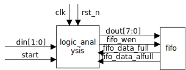

# 逻辑分析仪设计文档

作者：周成蹊

日期：2024.9.15

文档版本：ver 0.1s

| 日期      | 修订版本 | 描述         | 作者   |

| --------- | -------- | ------------ | ------ |

| 2024.9.23 | ver 0.1  | 初步完成文档 | 周成蹊 |

|           |          |              |        |

|           |          |              |        |

## 1.功能说明

- 可选择上升沿触发下降沿触发
- 
- 采样时钟可配置

### 1.1 结构框图

             
图1-1：结构框图
 

### 1.2 详细功能

- 指令输入指令寄存器，开始采样数据
- 检测到数据变化直接开始采样
- 采样得到的数据每经过四次采样脉冲存入fifo，dout[3:0]表示通道1采样得到的数据，较早的数据在大端，dout[7:4]表示通道2采样得到的数据
- 通过指令停止采样或fifo将满停止采样

## 2. 接口信号

| 信号名或变量名   | 方向  | 位宽或大小  | 描述         |
| ---------------- | ----- | ----------- | ------------ |
|                  |       |             |              |
| INPUT_WIDTH      | param | 2           | 输入通道个数 |
|                  |       |             |              |
| config_valid     | i     | 1           | 时钟         |
| config_in        | i     | 8           | 复位         |
| din              | i     | INPUT_WIDTH | 输入通道     |
| dout             | o     | 8           | 输出数据     |
| fifo_wen         | o     | 1           | fifo写使能   |
| fifo_data_full   | i     | 1           | fifo满       |
| fifo_data_alfull | i     | 1           | fifo将满     |

## 3. 参数配置

### 3.1 译码表

| 指令段 | 名称       | 描述                                                                                                                                              |
| ------ | ---------- | ------------------------------------------------------------------------------------------------------------------------------------------------- |
| 7      | 保留       | 保留                                                                                                                                              |
| 6:4    | 采样率控制 | 0：不采样； 1：19200bps采样率 2：38400bps采样率 3：57600bps 4：96000bps 5：192000bps 6：384000bps 7：576000bps |
| 3      | 时钟沿控制 | 1：上升沿采样 0：下降沿采样                                                                                                                  |
| 2：1   | 保留       | 保留                                                                                                                                              |
| 0      | 开始标志   | 1：采样开始                                                                                                                                       |

8'b0000_0000：停止采样
